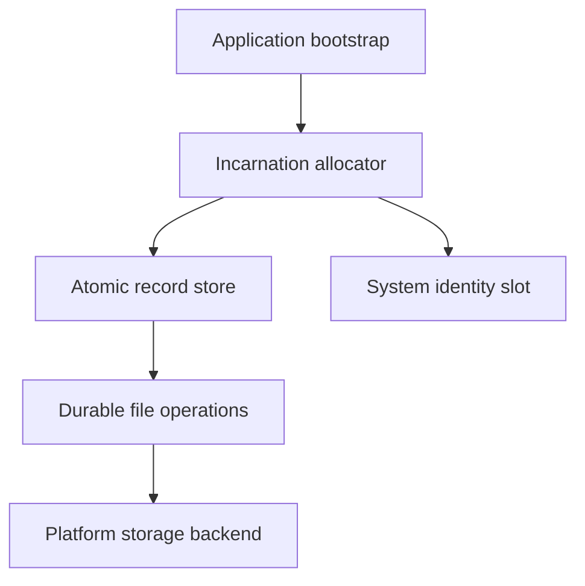

# Architecture

Persistence core depends on System for platform-neutral identity and storage abstractions. It does not depend on Primitive families, Radio, Mesh or Threads. Serializable, Security and Logging integrations remain explicit opt-in headers.

The allocator durably advances a device-bound high-water record before installing identity. Exactly one coordinator serves the process; service restarts do not allocate again. A failed bootstrap leaves local-only facilities available and identity-dependent services unavailable. System never calls Persistence.

`IAtomicRecordStore` exposes only fixed keys and caller-bounded buffers. `AtomicFileRecordStore<M,N>` copies its N keys during construction and uses one M+64 byte scratch buffer. Its versioned, key-bound, generation/integrity envelope is separate from each consumer's semantic record. Recovery validates published records and ignores uncommitted temporary files. Missing, corrupt, unsupported and ambiguous states remain explicit.

`AtomicFileStore` requires proven file sync, atomic target replacement and directory sync. It writes and syncs a prepared sibling, publishes it atomically, then syncs its parent directory. Failure after publication may have committed and returns CommitAmbiguous. There is no backup rollback, ordinary-write fallback or hidden dynamic path allocation. A backend must also declare bounded operations before it can bind `AtomicFileRecordStore`.

General `IFileStorage` and `IKeyValueStorage` still provide ordinary storage mechanics. They do not imply P4/C3/C4/S5 atomicity. General typed persistence preserves tree diagnostics/migrations; canonical Primitive persistence uses bounded Serializable codecs and atomic records. General file saves require durable atomic replacement by default; an explicit `RequireAtomicFileReplace=false` selects an ordinary general-purpose write, which is unsuitable for identity/execution/state durability.

Protected typed persistence delegates representation/protection to Serializable and Security. Authentication is not a substitute for crash-consistent storage. Persistence does not own ciphers, keys or cryptographic policy.

See [foundation validation](FOUNDATION_VALIDATION.md) for resource accounting and fault coverage.
