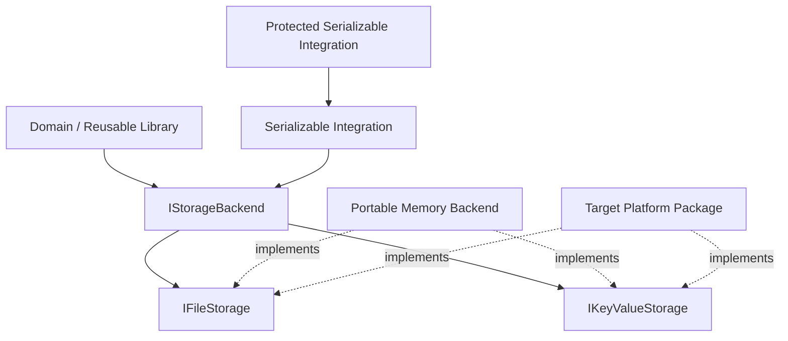

# Extension Architecture

Persistence extensions should preserve the separation between storage semantics, backend implementation, serialization, and security.

## Ownership rule

Persistence owns portable storage contracts, capabilities, atomic-replacement policy and optional typed-persistence adapters.

Target-specific filesystem, flash, NVS, SD, driver and SDK implementation belongs in the platform package.

## Extension invariants

Keep core Persistence platform-neutral, retain distinct file/key-value semantics, advertise capabilities truthfully, preserve bounded reads/decoding, propagate partial writes/failures explicitly, and keep optional integrations optional.