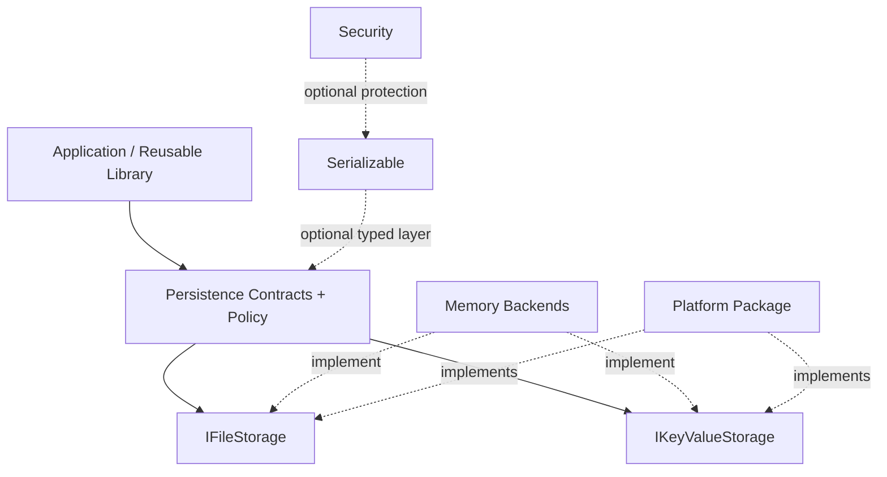

# ESPressio Persistence

> Documentation baseline: **1.0.0**

ESPressio Persistence provides capability-aware, platform-neutral storage contracts and persistence policy for the ESPressio Development Platform.

Application and reusable library code can store/retrieve data without depending directly on LittleFS, SPIFFS, FAT, SD, Preferences/NVS, or another concrete backend.

## Choose your documentation path

### Using the library

- [Getting Started](Getting-Started)
- [Storage Backends and Capabilities](Storage-Backends-and-Capabilities)
- [File Storage](File-Storage)
- [Key Value Storage](Key-Value-Storage)
- [Atomic File Replacement](Atomic-File-Replacement)
- [Memory Backends](Memory-Backends)
- [Typed Serializable Persistence](Typed-Serializable-Persistence)
- [Protected Persistence](Protected-Persistence)
- [Reliability and Failure Handling](Reliability-and-Failure-Handling)

### Extending the library

- [Extension Architecture](Extension-Architecture)
- [Implementing Storage Backends](Implementing-Storage-Backends)
- [Implementing File Storage](Implementing-File-Storage)
- [Implementing Key Value Storage](Implementing-Key-Value-Storage)
- [Capability Contract](Capability-Contract)
- [Platform Provider Ownership](Platform-Provider-Ownership)
- [Testing Storage Backends](Testing-Storage-Backends)

## Architecture

Persistence owns storage semantics; concrete hardware/backend implementations belong in the appropriate platform package.