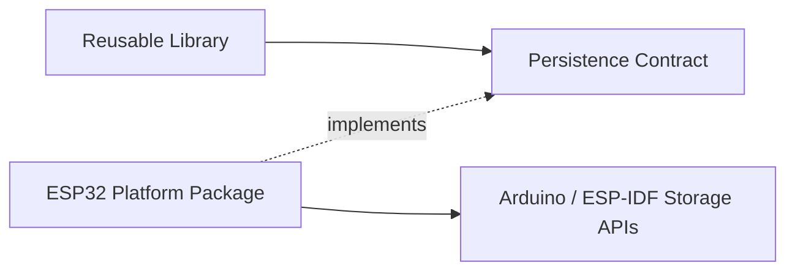

# Platform Provider Ownership

Portable Persistence owns **storage semantics**. Concrete hardware/storage implementations belong to the platform package that owns the relevant SDK and drivers.

For ESP32, implementations such as LittleFS, SPIFFS, FFat, SD, SD/MMC and Preferences/NVS satisfy Persistence interfaces from the ESP32 platform layer rather than from this repository.

## Why this boundary matters

A reusable ESPressio library can depend on Persistence without acquiring Arduino filesystem, SD, Preferences, ESP-IDF or board-specific headers.

## Adding a new target

Implement its storage providers in the corresponding target/platform repository and keep the Persistence contracts unchanged unless the new platform exposes a genuinely portable semantic capability missing from the abstraction.

## Adding a new storage device

Driver/media details belong with the platform or dedicated driver integration. Persistence should see only an appropriate `IFileStorage` or `IKeyValueStorage` implementation and truthful capabilities.